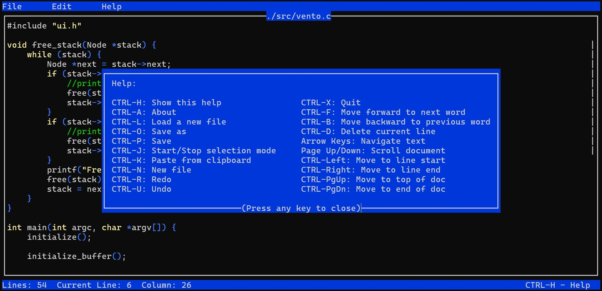

# Vento Text Editor

Welcome to Vento, the lightweight text editor that's all about keeping things simple and easy to use. Whether you're coding, jotting down notes, or working on your next big writing project, Vento has got you covered.

> **DISCLAIMER:**
> 
> Vento is currently in development and should not be considered stable software. This project is under active construction, and as such, it likely contains bugs, incomplete features, and unstable behavior. Use at your own risk. We do not recommend relying on Vento for critical or production use at this time.
>
> We appreciate any feedback, bug reports, or contributions to help improve the project. Thank you for your understanding and support!



## Current Features

Vento currently supports the following features:

- **Basic Editor**: Provides essential text editing capabilities.
- **Load Files**: Open and edit existing files.
- **Create New File**: Start a new document easily.
- **Save As**: Save your work with a new filename.
- **Save Feature**: Save changes without being prompted for a filename each time.
- **Undo and Redo**: Undo and redo actions to correct mistakes.
- **Delete Current Line**: Press `CTRL-D` to delete the current line.
- **Word Navigation**: Use `CTRL-F` to move to the next word and `CTRL-B` to move to the previous word.
- **Customizable Configuration**: Customize settings through a configuration file.
- **Basic Syntax Highlighting**: Simple syntax highlighting for C, HTML, and Python files.
- **Status Bar**: Displays the current line and column number.
- **Scroll Bar**: Indicates your position within the document.
- **Help Screen**: Press `CTRL-H` for a guide to Vento's features.
- **About Box**: Press `CTRL-A` to view product information, version, and GPL message.
- **Menu System**: Intuitive menu navigation for editor features.

## Planned Features

The following features are planned for future releases:

- **Support Multiple Files**: Work on multiple files simultaneously.
- **Copy and Paste**: Enhanced clipboard functionality for text movement.
- **Spell Checker Support**: Automatically detect and correct typos.
- **Git Integration**: Integrate with Git for version control.
- **Macro Support**: Configurable keyboard macros for repetitive tasks.
- **Extensions API**: Plugin support to extend editor capabilities.

## Prerequisites

Before you can compile Vento, make sure you have the following installed:

- **GCC**: The GNU Compiler Collection for compiling the source code.
- **Binutils**: A collection of binary tools.
- **Ncurses Dev Libraries**: Development libraries for Ncurses (necessary for text-based user interfaces).

On Debian-based systems, you can install these with:

```bash
sudo apt update
sudo apt install build-essential libncurses5-dev libncursesw5-dev
```

## Getting Started

Ready to give Vento a try? Here's how to get started:

```bash
git clone https://github.com/splanck/vento.git
cd vento
make
sudo make install
```

Thanks for checking out Vento! Happy editing!
