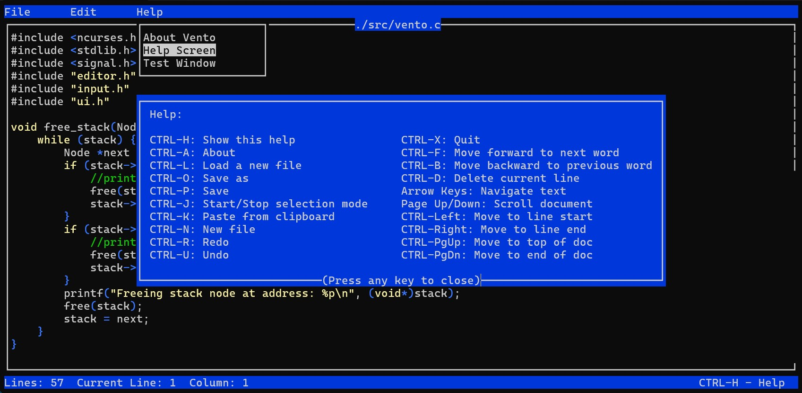

# Vento Text Editor

Welcome to Vento, the lightweight text editor that's all about keeping things simple and easy to use. Whether you're coding, jotting down notes, or working on your next big writing project, Vento has got you covered.

> **DISCLAIMER:**
> 
> Vento is currently in development and should not be considered stable software. This project is under active construction, and as such, it likely contains bugs, incomplete features, and unstable behavior. Use at your own risk. We do not recommend relying on Vento for critical or production use at this time.
>
> We appreciate any feedback, bug reports, or contributions to help improve the project. Thank you for your understanding and support!



## Current Version

**Version 0.1.3**  
We are currently in the initial development phase, focusing on building the core functionalities. This is a development version, and while there are no official releases at this time, the source code is accessible on GitHub for download and building.

## Current Features

Vento currently supports the following features:

- **Basic Editor**: Provides essential text editing capabilities.
- **Load Files**: Press `CTRL-L` to open a dialog for browsing directories or typing a filename, then edit the selected file.
- **Create New File**: Start a new document easily.
- **Save As**: Press `CTRL-O` or choose "Save As" from the File menu to open a dialog for browsing directories or typing a new filename.
- **Save Feature**: Press `CTRL-S` to save changes without being prompted for a filename each time.
- **Undo and Redo**: Press `CTRL-Z` to undo and `CTRL-Y` to redo actions.
- **Find**: Press `CTRL-F` to open a search dialog that can stay open so you can repeat searches. Use `F3` to jump to the next occurrence of the current search text.
- **Replace**: Press `CTRL-R` or choose **Edit -> Replace** to search and replace text.
- **Delete Current Line**: Press `CTRL-D` to delete the current line.
- **Word Navigation**: Use `CTRL-W` to move to the next word and `CTRL-B` to move to the previous word.
- **Close Current File**: Press `CTRL-Q` to close the active file.
- **Customizable Configuration**: Customize settings through a configuration file.
- **Interactive Settings Dialog**: Open **File → Settings** and use the arrow
  keys or mouse clicks to choose options. Mouse support can be enabled or
  disabled in this dialog, and all dialogs accept mouse input.
- **Basic Syntax Highlighting**: Simple syntax highlighting for C, HTML, and Python files.
- **Status Bar**: Displays the current line and column number.
- **Scroll Bar**: Indicates your position within the document.
- **Help Screen**: Press `CTRL-H` for a guide to Vento's features.
- **About Box**: Press `CTRL-A` to view product information, version, and GPL message.
 - **Menu System**: Intuitive menu navigation for editor features.
- **Mouse Support**: Click to move the cursor, drag to select text, scroll with the wheel, and click the menu bar and its items.

## Configuration File

Vento reads settings from a `.ventorc` file in your home directory.  The file is
written in the same key order as the defaults.  When you exit the settings
dialog with changes, the updated configuration is automatically saved back to
`~/.ventorc`.

This file is created automatically with default values if it does not exist. Unknown keys are ignored when the file is parsed. You can also change these options interactively using the **Settings** dialog. Open it from *File → Settings* (press `CTRL-T` to open the menu) and navigate with the arrow keys. The recognized keys are:
- `background_color`
- `keyword_color`
- `comment_color`
- `string_color`
- `type_color`
- `symbol_color`
- `enable_color`
- `enable_mouse`

Set `enable_mouse` to `false` if you want to disable mouse input entirely.

### Multi-File Support

Vento allows multiple files to be opened at once. Press `CTRL-L` to open a
dialog for browsing directories or typing a filename, and switch between loaded
files with `F6` for the next file or `F7` for the previous one.

## Planned Features

The following features are planned for future releases:

- **Syntax Highlighting**: Support for more languages and improved highlighting.
- **Large File Support**: Improved optimizations for handling large files.
- **FTP Support**: Access files on FTP servers as if they were locally stored.
- **Theme Support**: Multiple built in themes for easy visual customization.
- **Spell Checker Support**: Automatically detect and correct typos.
- **Git Integration**: Integrate with Git for version control.
- **Macro Support**: Configurable keyboard macros for repetitive tasks.
- **Extensions API**: Plugin support to extend editor capabilities.

## Known Issues

No known issues at this time.

## Roadmap

Here's a roadmap for Vento's development milestones:

- **0.1.x - Initial Development Phase:**  
  These versions are the foundation of Vento, focusing on building and stabilizing core features. We are currently in this phase. Although this version number is occasionally incremented, there are no actual releases during this phase. **Current Version: 0.1.3**

- **0.2.x - Feature Incomplete Unstable Public Releases:**  
  These releases will expand the feature set and refine existing capabilities, although they may still be unstable. They will serve as a platform for gathering user feedback as we enhance Vento's functionality.

- **0.3.x - Near Feature Complete Unstable Versions:**  
  These versions will showcase a more cohesive feature set, though some functionalities may still be under construction. We aim to gather community feedback to polish the editor.

- **0.4.x - Feature Complete Test Builds:**  
  Vento will be feature-complete, focusing on testing and fixing bugs. These builds will be more stable and are intended for users who want to try the full range of features before the official release.

- **0.9.x - Feature Complete Release Candidates:**  
  These are pre-release candidates, ready for broader testing. We'll focus on final optimizations, performance improvements, and ironing out any remaining issues.

- **1.0 - Initial Version Final Release:**  
  This will be the first official release of Vento, marking the culmination of development efforts. It will be stable, fully functional, and ready for general use, featuring a polished and reliable user experience.

## Prerequisites

Before you can compile Vento, make sure you have the following installed:

- **GCC**: The GNU Compiler Collection for compiling the source code.
- **Binutils**: A collection of binary tools.
- **Ncurses Dev Libraries**: Development libraries for Ncurses (necessary for text-based user interfaces).

On Debian-based systems, you can install these with:

```bash
sudo apt update
sudo apt install build-essential libncurses5-dev libncursesw5-dev
```

## Getting Started

Ready to give Vento a try? Here's how to get started:

```bash
git clone https://github.com/splanck/vento.git
cd vento
make
sudo make install
```

## Enabling Debug Output

Vento includes optional debug messages within the configuration loader. To see
these messages during execution, compile the editor with the `DEBUG` macro
defined:

```bash
make CFLAGS="-Wall -Wextra -std=c99 -g -DDEBUG"
```

## Running Tests

To run Vento's unit tests, execute the following command from the project
root:

```bash
make test
```

This invokes `tests/run_tests.sh`, which builds and runs the tests.  You can
also run the script directly:

```bash
sh tests/run_tests.sh
```

## Contributing to Vento

While I am not actively seeking contributors for the Vento project, if the project interests you and you would like to contribute, please feel free to reach out. You can email me at splanck@tutamail.com.

Thanks for checking out Vento! Happy editing!
